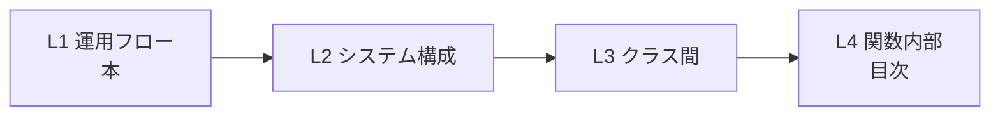

# SeqShelf 規約 — 4階層シーケンス図の「本棚」

> 本棚から本を取り出して読むように、見たい所のシーケンス図を取り出して読む。
> **本＝運用フロー**、**目次＝関数レベル**。社会／歴史／文学のように分類された棚を、
> リンクで自由に行き来する。

この文書は SeqShelf 拡張が解釈する **frontmatter スキーマ / リンク記法 / 制御ブロック規約**
を定義します。`examples/` に準拠サンプル（受注フロー）があります。

---

## 1. 4 つの階層

| 層 | 名称 | 縦線 (participant) の単位 | 横線 (message) の単位 | 例 |
| --- | --- | --- | --- | --- |
| **L1** | 運用フロー | アクター / 外部システム | 業務イベント | 顧客→ECサイト→倉庫 |
| **L2** | システム構成 | プロセス / DB / API / キュー | リクエスト・クエリ・ジョブ | WebApp→OrderAPI→DB |
| **L3** | クラス間 | クラス / モジュール | メソッド呼び出し | Controller→Service→Repo |
| **L4** | 関数内部 | 呼び出し元 / 自身 / 依存 | 文・分岐・例外 | validateOrder() の中身 |

- **縦線を足す** = `participant` / `actor` を 1 行足すだけ。
- **横線を足す** = `A->>B: ラベル` を 1 行足すだけ。
- **横線の詳細を別図にする** = その行に下階層図へのリンクを付ける（§3）。



---

## 2. frontmatter スキーマ

各 `.md` は先頭に YAML frontmatter を持ち、1 ファイル 1 図（1 つの ```mermaid sequenceDiagram）を書く。

```yaml
---
id: L3-order-validation          # 必須・一意。命名: L{1-4}-<kebab-case>
layer: L3                        # 必須。L1|L2|L3|L4
title: 受注バリデーション         # 表示名 (省略時は id)
parent: L2-order-system#validate # 上位図のステップ。"<上位id>#<step>" (L1 は省略)
children:                        # 下位図 id の配列 (ツリー/パンくず用)
  - L4-validateOrder
  - L4-validateOrder-timeout
actors:                          # 宣言アクター。Mermaid の participant と一致させる
  - OrderController
  - OrderValidator
  - InventoryRepo
targetSymbols:                   # L4 専用。コード→図 逆引きのキー "<相対パス>#<関数名>"
  - src/order/validator.ts#validateOrder
links:                           # 機械可読リンク (ラベル -> 図id)。最優先で解決される
  正常系: L4-validateOrder
  タイムアウト系: L4-validateOrder-timeout
---
```

| キー | 必須 | 用途 |
| --- | --- | --- |
| `id` | ✅ | 図のグローバル一意 ID。リンクの宛先になる |
| `layer` | ✅ | 階層。ツリーの段に対応 |
| `title` | — | 人間向け表示名 |
| `parent` | L2〜L4 | パンくずの親。`#step` でどのメッセージから来たかを指す |
| `children` | — | 明示的な下位図。リンクが無くてもツリーに出る |
| `actors` | — | 宣言。Mermaid 内 participant と差異があればリント警告 |
| `targetSymbols` | L4 | `validateOrder` を参照する図として逆引き対象になる |
| `links` | — | `click` やインラインリンクと併用可。frontmatter が最優先 |

### 命名規約

- 図 id: `L{層}-{kebab}`（例 `L4-validate-order`）。層プレフィックス必須。
- step アンカー: 上位図の **メッセージ id**（ラベルの slug）か `links` のキー。

---

## 3. リンク 4 記法（すべて許容・`linkResolver` が正規化）

「この横線の詳細は別のシーケンス図に書いてある」を表す方法は 4 つ。混在可。
解決の優先度は **frontmatter > click > inline > note**。

| # | 記法 | 粒度 | 例 |
| --- | --- | --- | --- |
| 1 | **frontmatter `links`** | 図レベル | `links:`<br/>`  正常系: L4-validateOrder` |
| 2 | **Mermaid `click`** | participant | `click OrderValidator href "L4-validateOrder.md"` |
| 3 | **インライン md link** | メッセージ | `OrderAPI->>OrderAPI: validate() [→詳細](L3-order-validation.md)` |
| 4 | **`Note … see`** | 図レベル | `Note over InventoryRepo: see L4-validateOrder-timeout` |

### リンク先の書き方（どれでも解決される）

- `L4-validateOrder`（id 直接）
- `L4-validateOrder#step`（アンカー付き → id 部分を採用）
- `L4-validateOrder.md` / `./L4-validateOrder.md` / `../x/L4-validateOrder.md`（パス → ファイル名を id とみなす）

> リンク先 id がインデックスに無い場合は **リンク切れ**として Problems に警告が出る。

---

## 4. エラー / タイムアウト規約（alt / opt / par / break / critical をフル活用）

特に **L4** では正常系だけでなく異常系を必ず描く。`examples/L4-validateOrder-timeout.md` が見本。

| ブロック | 用途 | 雛形スニペット |
| --- | --- | --- |
| `alt timeout / else success` | タイムアウト分岐 | `seq-alt-timeout` |
| `alt error / else ok` | 業務エラー分岐 | （`seq-l4` に内蔵） |
| `opt retry on transient` | リトライ | （`seq-alt-timeout` に内蔵） |
| `par … and … end` | 並列呼び出し | `seq-par` |
| `break <理由>` | 早期中断（例外送出） | `seq-break` |
| `critical … option … end` | 必ず実行する後始末（接続・ネットワーク断） | `seq-critical` |

### ルール

1. **L4 図は最低 1 つの `alt` / `break` / `critical` を含む**（含まないとリント警告。
   `seqshelf.requireBranchInL4` で無効化可）。
2. タイムアウトは `--x`（消失メッセージ）で「応答が来なかった」ことを明示する。
3. リトライは `opt` で囲み、上限超過は `break` で抜ける。
4. 後始末（クローズ・ロールバック）は `critical` に置き、`option` で障害系を併記する。

---

## 5. 拡張の使い方（本棚を読む）

| やりたいこと | 操作 |
| --- | --- |
| 本棚を見る | アクティビティバーの **SeqShelf** → 「本棚」ツリー（L1→L2→L3→L4） |
| 図を読む | ツリーの本をクリック → プレビューに Mermaid 描画 |
| 下階層へ降りる | プレビュー内のリンク/ノードをクリック、または横線で右クリック →「下階層の詳細を開く」 |
| 親へ戻る | プレビュー上部のパンくず、または「パンくず」ビュー |
| 図を書く | スニペット `seq-l1`〜`seq-l4`、`seq-alt-timeout` 等／コマンド「図テンプレートを挿入」 |
| コードから図へ | TS/JS 関数上の CodeLNS「＋ New L4 diagram」「N 件の図」 |
| 図からコードを探す | コマンド「この関数を参照する図を一覧」 |
| 横断検索 | コマンド「図を横断検索」 |

リント（Problems に表示）:
リンク切れ / 未宣言 participant / id 重複 / parent ステップ不在 / 親子循環 / L4 の分岐欠如。

---

## 6. テンプレート

`templates/L1.md`〜`templates/L4.md` をコピーして使うか、スニペットを利用してください。
`examples/` は実際にリンクが繋がった完全な見本です（受注フロー L1→L2→L3→L4×2）。
