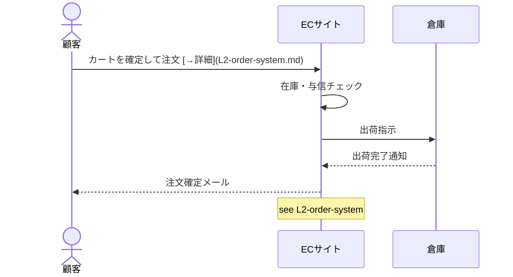

# 受注フロー (L1 運用フロー)

顧客が商品を注文してから倉庫が出荷するまでの業務フロー。各横線（メッセージ）は
下階層でシステム構成・クラス・関数へと掘り下げられる。

```mermaid
sequenceDiagram
  actor 顧客
  participant ECサイト
  participant 倉庫

  顧客->>ECサイト: カートを確定して注文 [→詳細](L2-order-system.md)
  ECサイト->>ECサイト: 在庫・与信チェック
  ECサイト->>倉庫: 出荷指示
  倉庫-->>ECサイト: 出荷完了通知
  ECサイト-->>顧客: 注文確定メール
  Note over ECサイト: see L2-order-system
```
