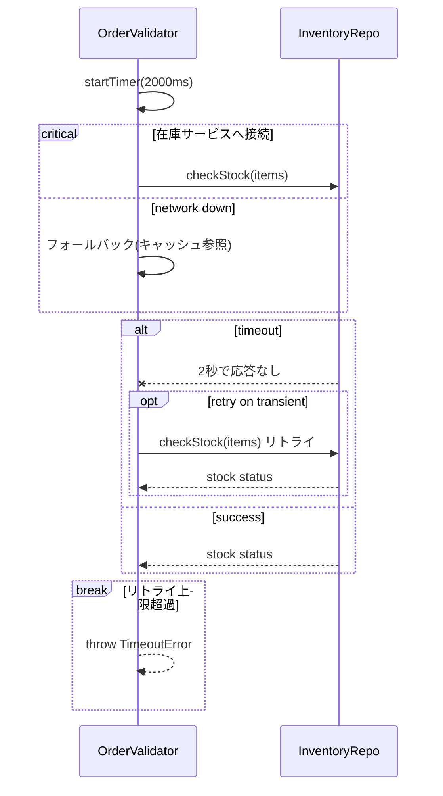

# validateOrder() の内部 (L4 関数内部・タイムアウト/異常系)

在庫サービス呼び出しの **タイムアウト / リトライ / 中断 / 後始末** を
alt・opt・break・critical を使って網羅したもの。

```mermaid
sequenceDiagram
  participant OrderValidator
  participant InventoryRepo

  OrderValidator->>OrderValidator: startTimer(2000ms)

  critical 在庫サービスへ接続
    OrderValidator->>InventoryRepo: checkStock(items)
  option network down
    OrderValidator->>OrderValidator: フォールバック(キャッシュ参照)
  end

  alt timeout
    InventoryRepo--xOrderValidator: 2秒で応答なし
    opt retry on transient
      OrderValidator->>InventoryRepo: checkStock(items) リトライ
      InventoryRepo-->>OrderValidator: stock status
    end
  else success
    InventoryRepo-->>OrderValidator: stock status
  end

  break リトライ上限超過
    OrderValidator-->>OrderValidator: throw TimeoutError
  end
```
