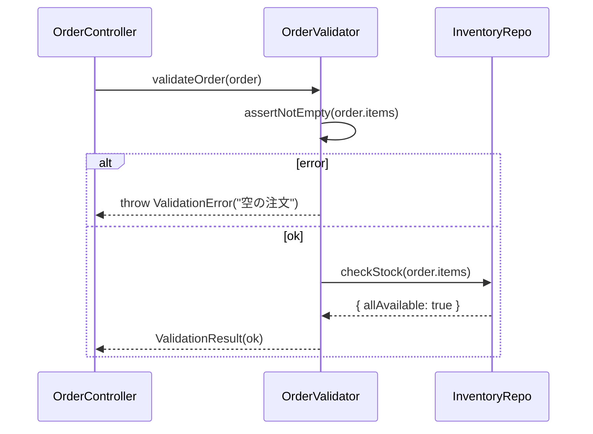

# validateOrder() の内部 (L4 関数内部・正常系)

関数 `validateOrder` の制御フロー。入力検証 → 在庫確認 → 結果返却。
業務エラーは `alt error` 分岐で表現する。

```mermaid
sequenceDiagram
  participant OrderController
  participant OrderValidator
  participant InventoryRepo

  OrderController->>OrderValidator: validateOrder(order)
  OrderValidator->>OrderValidator: assertNotEmpty(order.items)

  alt error
    OrderValidator-->>OrderController: throw ValidationError("空の注文")
  else ok
    OrderValidator->>InventoryRepo: checkStock(order.items)
    InventoryRepo-->>OrderValidator: { allAvailable: true }
    OrderValidator-->>OrderController: ValidationResult(ok)
  end
```
