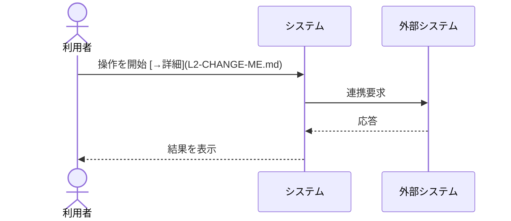

# 運用フロー名 (L1 運用フロー)

```mermaid
sequenceDiagram
  actor 利用者
  participant システム
  participant 外部システム

  利用者->>システム: 操作を開始 [→詳細](L2-CHANGE-ME.md)
  システム->>外部システム: 連携要求
  外部システム-->>システム: 応答
  システム-->>利用者: 結果を表示
```
