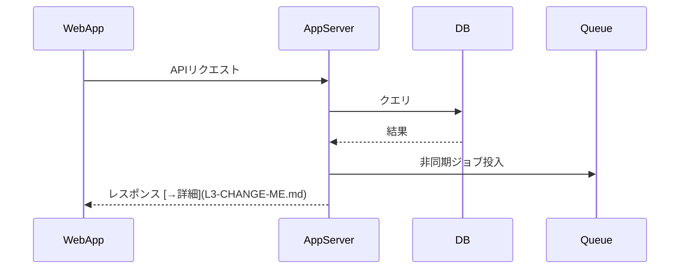

# システム構成名 (L2 システム構成)

```mermaid
sequenceDiagram
  participant WebApp
  participant AppServer
  participant DB
  participant Queue

  WebApp->>AppServer: APIリクエスト
  AppServer->>DB: クエリ
  DB-->>AppServer: 結果
  AppServer->>Queue: 非同期ジョブ投入
  AppServer-->>WebApp: レスポンス [→詳細](L3-CHANGE-ME.md)
```
