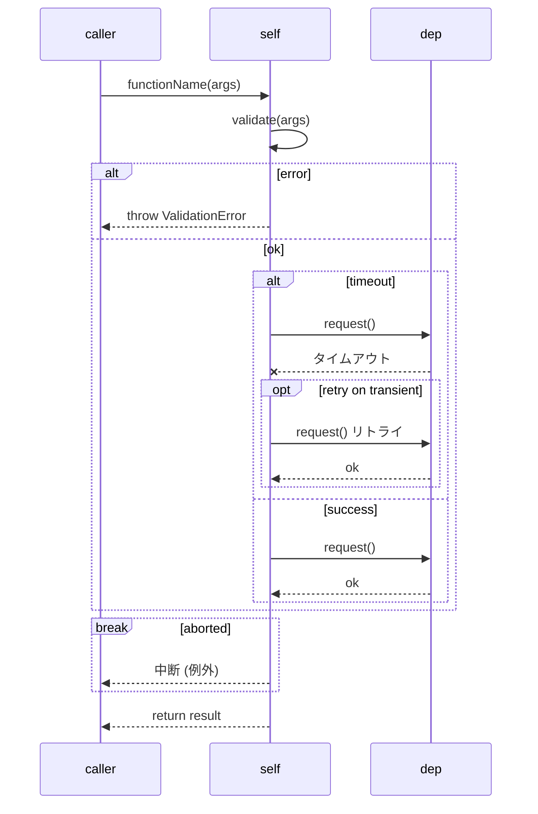

# 関数名() の内部 (L4 関数内部)

```mermaid
sequenceDiagram
  participant caller
  participant self
  participant dep

  caller->>self: functionName(args)
  self->>self: validate(args)

  alt error
    self-->>caller: throw ValidationError
  else ok
    alt timeout
      self->>dep: request()
      dep--xself: タイムアウト
      opt retry on transient
        self->>dep: request() リトライ
        dep-->>self: ok
      end
    else success
      self->>dep: request()
      dep-->>self: ok
    end
  end

  break aborted
    self-->>caller: 中断 (例外)
  end

  self-->>caller: return result
```
